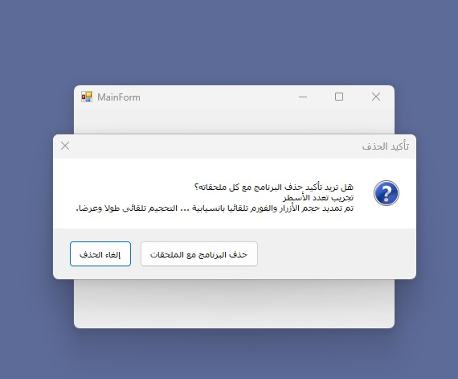

# DouhaSoft-MessageBox
C# WinForms MessageBox With Custom Button Text

## Usage
Simply.. copy DSMessageBox Form to your project, then add these lines when you want to call it.
```csharp
private void askBtn_Click(object sender, EventArgs e)
{
    DSMessageBox dSMessageBox = new DSMessageBox();
    var response = dSMessageBox.Show(
        "Message text", SystemIcons.Question, "Caption",
        "Accept button", "Cancel button",isRTL: true);

    if (response == DialogResult.OK)
    {
        this.Text = "Done";
    }
    else
    {
        this.Text = "Canceled";
    }
}
```
## Screenshot


